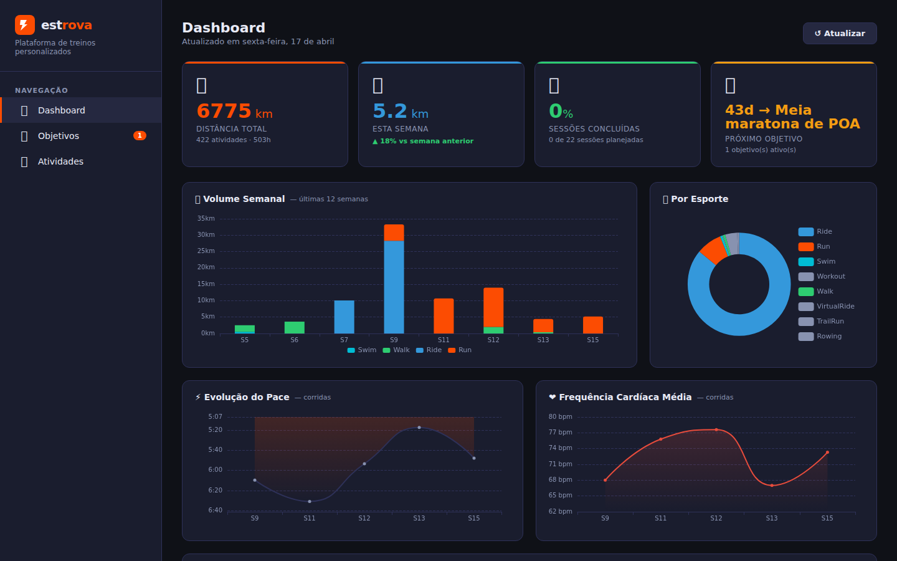
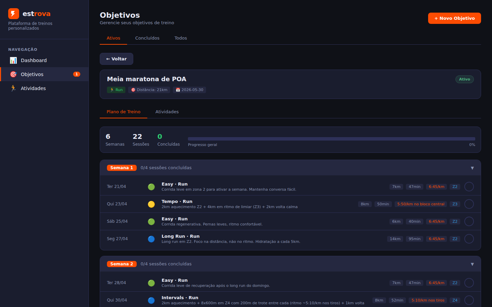
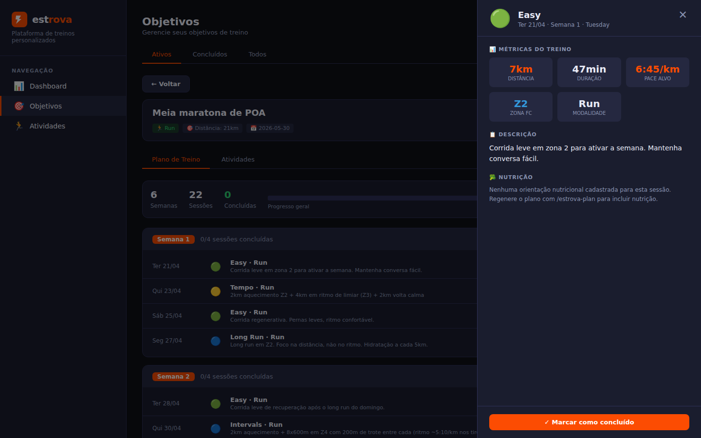
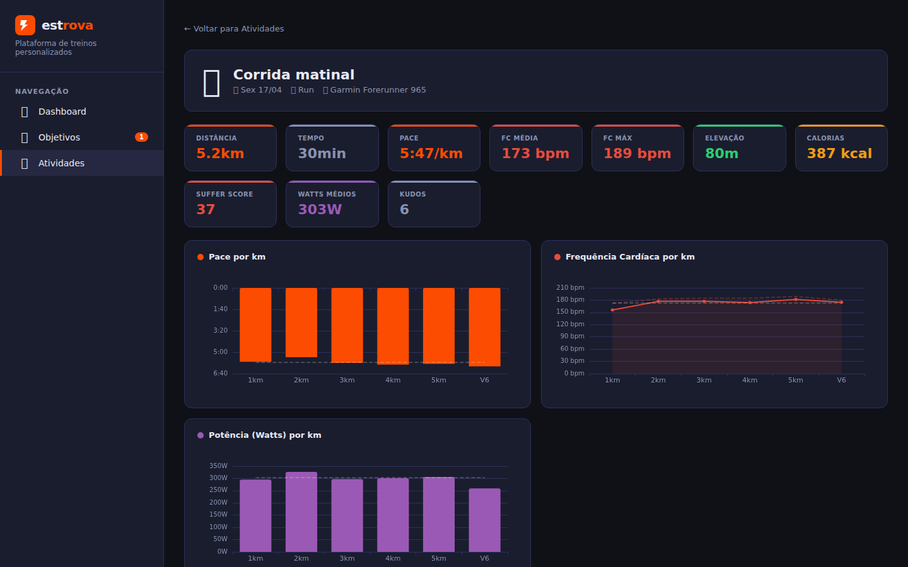

<p align="center">
  
</p>

# Estrova para Claude Code

Um servidor MCP (Model Context Protocol) que integra seus dados de treino do Strava com o Claude Code. Obtenha planos de treino personalizados por IA, análise de desempenho e um dashboard web — tudo baseado no seu histórico real do Strava.

## Screenshots

<table>
  <tr>
    <td></td>
    <td></td>
  </tr>
  <tr>
    <td align="center"><em>Dashboard com KPIs e gráficos</em></td>
    <td align="center"><em>Plano de treino por objetivo</em></td>
  </tr>
  <tr>
    <td></td>
    <td></td>
  </tr>
  <tr>
    <td align="center"><em>Drawer de detalhe da sessão de treino</em></td>
    <td align="center"><em>Detalhe de atividade com gráficos por km</em></td>
  </tr>
</table>

---

## O que ele faz

- Autentica com o Strava via OAuth2 e sincroniza suas atividades em um banco SQLite local
- Expõe 16 ferramentas MCP para o Claude ler seu perfil, estatísticas, zonas de FC, atividades e objetivos de treino
- Gera e armazena planos de treino personalizados de múltiplas semanas com base no seu histórico
- Detecta e resolve conflitos de agendamento entre múltiplos objetivos simultâneos
- Serve um dashboard web em `http://localhost:3030` para gerenciamento visual do plano
- Fornece backup e restauração do banco de dados via linha de comando

---

## Índice

1. [Pré-requisitos](#pré-requisitos)
2. [Obtendo as credenciais da API do Strava](#obtendo-as-credenciais-da-api-do-strava)
3. [Instalação](#instalação)
4. [Configurando o Claude Code](#configurando-o-claude-code)
5. [Autenticação inicial](#autenticação-inicial)
6. [Sincronizando atividades](#sincronizando-atividades)
7. [Skills disponíveis no Claude Code](#skills-disponíveis-no-claude-code)
8. [Criando um objetivo e plano de treino](#criando-um-objetivo-e-plano-de-treino)
9. [Dashboard web](#dashboard-web)
10. [Linha de comando (CLI)](#linha-de-comando-cli)
11. [Ferramentas MCP disponíveis](#ferramentas-mcp-disponíveis)
12. [Banco de dados](#banco-de-dados)

---

## Pré-requisitos

- [Claude Code](https://claude.ai/code) instalado
- Uma conta no [Strava](https://www.strava.com)

Nenhum outro runtime é necessário — binários pré-compilados são fornecidos para Linux, macOS e Windows.

---

## Obtendo as credenciais da API do Strava

Você precisa registrar um aplicativo no Strava para obter as credenciais usadas na autenticação. Esse processo é feito apenas uma vez.

> Para uma visão geral completa da API do Strava, consulte a [documentação oficial de primeiros passos](https://developers.strava.com/docs/getting-started/).

### Passo 1 — Acesse as configurações da API do Strava

Acesse [https://www.strava.com/settings/api](https://www.strava.com/settings/api).

Se solicitado, faça login na sua conta Strava primeiro.

### Passo 2 — Crie seu aplicativo

Preencha o formulário com os seguintes valores:

| Campo | Valor |
|-------|-------|
| **Nome do aplicativo** | Qualquer nome, ex: `Meu Coach Claude` |
| **Categoria** | Qualquer (ex: `Outro`) |
| **Clube** | Deixe em branco |
| **Website** | `http://localhost` |
| **Descrição** | Opcional |
| **Domínio de callback de autorização** | `localhost` |

Clique em **Criar** (ou **Atualizar** se já existir um aplicativo anterior).

### Passo 3 — Copie suas credenciais

Após salvar, a página exibe os detalhes do aplicativo. Anote:

- **Client ID** — um número curto, ex: `152485`
- **Client Secret** — uma string hexadecimal longa

> Essas credenciais são sensíveis. Nunca as compartilhe nem as comite em repositórios.

### Passo 4 — Faça upload de um ícone (opcional)

O Strava exige um ícone antes que a tela de consentimento OAuth funcione. Faça upload de qualquer imagem (PNG/JPG, mínimo 124×124 px) no campo **Ícone do aplicativo** e salve.

---

> **Observação:** A URL de callback de autorização usada por este servidor MCP é `http://localhost:8765/callback`. O Strava verifica apenas o **domínio** (`localhost`), portanto nenhuma configuração adicional de URL é necessária.

---

## Instalação

Binários pré-compilados são publicados automaticamente a cada release. Não é necessário ter Go instalado.

### Linux / macOS (uma linha)

```bash
curl -fsSL https://raw.githubusercontent.com/booscaaa/estrova/main/install.sh | bash
```

Este script detecta seu sistema operacional e arquitetura, baixa o binário correto da última release do GitHub, instala em `/usr/local/bin/estrova` e também instala as skills do estrova no Claude Code.

### Download manual

1. Acesse a [página de Releases](https://github.com/booscaaa/estrova/releases/latest)
2. Baixe o arquivo para sua plataforma:

| Plataforma | Arquivo |
|------------|---------|
| Linux x86-64 | `estrova_linux_amd64.tar.gz` |
| Linux ARM64 | `estrova_linux_arm64.tar.gz` |
| macOS x86-64 (Intel) | `estrova_darwin_amd64.tar.gz` |
| macOS ARM64 (Apple Silicon) | `estrova_darwin_arm64.tar.gz` |
| Windows x86-64 | `estrova_windows_amd64.zip` |

3. Extraia e mova o binário:

```bash
# Linux / macOS
tar -xzf estrova_linux_amd64.tar.gz
sudo mv estrova /usr/local/bin/
chmod +x /usr/local/bin/estrova
```

```powershell
# Windows — extraia o zip e mova estrova.exe para uma pasta no seu PATH
# ex: C:\Users\<voce>\bin\estrova.exe
```

4. Verifique:

```bash
estrova --help
```

### Compilar do fonte (opcional)

Necessário apenas se quiser modificar o código:

```bash
git clone https://github.com/booscaaa/estrova.git
cd estrova
go build -o estrova .
sudo mv estrova /usr/local/bin/
```

---

## Configurando o Claude Code

### Configuração global (todos os projetos)

Edite `~/.claude/settings.json`:

```json
{
  "mcpServers": {
    "estrova": {
      "command": "estrova",
      "env": {
        "STRAVA_CLIENT_ID": "seu_client_id",
        "STRAVA_CLIENT_SECRET": "seu_client_secret"
      }
    }
  }
}
```

Substitua `estrova` pelo caminho completo do binário caso ele não esteja no seu `$PATH`.

### Configuração por projeto

Crie ou edite `.mcp.json` na raiz do seu projeto:

```json
{
  "mcpServers": {
    "estrova": {
      "command": "/usr/local/bin/estrova",
      "env": {
        "STRAVA_CLIENT_ID": "seu_client_id",
        "STRAVA_CLIENT_SECRET": "seu_client_secret"
      }
    }
  }
}
```

> **Dica:** Adicione `.mcp.json` ao `.gitignore` para que suas credenciais nunca sejam commitadas.

### Verificando se o servidor MCP está conectado

Abra o Claude Code e execute:

```
/mcp
```

Você deve ver `estrova` listado como servidor conectado. Caso contrário, verifique o caminho do binário e as variáveis de ambiente.

---

## Autenticação inicial

A primeira coisa que você precisa fazer é autenticar com o Strava. No Claude Code, basta perguntar:

```
autenticar com strava
```

O Claude chamará `estrova_authenticate`, que:

1. Inicia um servidor local de callback em `http://localhost:8765/callback`
2. Abre seu navegador na página de consentimento OAuth do Strava
3. Após você aprovar, troca o código por um token de acesso
4. Salva o token em `~/.estrova.db` (SQLite)

O token é atualizado automaticamente quando expira — você só precisa autenticar uma vez.

**Verificar status da autenticação:**

```
qual é o status da minha autenticação no strava?
```

---

## Sincronizando atividades

Após autenticar, sincronize suas atividades do Strava no banco local:

```
sincronizar minhas atividades do strava
```

Por padrão, busca até 5 páginas (1.000 atividades). Para buscar mais:

```
sincronizar minhas atividades do strava, buscar 10 páginas
```

As atividades sincronizadas são armazenadas localmente e associadas automaticamente às sessões do seu plano de treino.

---

## Skills disponíveis no Claude Code

As skills são atalhos inteligentes que ativam fluxos completos de interação com o estrova. Após a instalação, elas ficam disponíveis como comandos `/` no Claude Code.

### `/estrova-coach` — Treinador pessoal

Ponto de entrada principal. Verifica seu status, lista objetivos e orienta os próximos passos.

```
/estrova-coach
```

```
como estou indo nos meus treinos?
```

```
o que devo focar essa semana?
```

O coach verifica automaticamente:
- Se você está autenticado (orienta `estrova_authenticate` se não estiver)
- Se há atividades sincronizadas (sugere `estrova_sync` se necessário)
- Seus objetivos ativos e o estado de cada plano

---

### `/estrova-plan` — Gerador de plano de treino

Cria um plano de treino periodizado e personalizado para um objetivo específico, baseado no seu histórico real do Strava.

```
/estrova-plan
```

```
gera um plano de treino para minha maratona
```

```
quero um plano para o objetivo Meia Maratona POA
```

O que o plano inclui:
- Semanas organizadas por fase (Base, Build, Peak, Taper)
- Tipos de sessão: Easy, Long, Tempo, Interval, Race, Rest, Cross, Strength
- Progressão de volume ≤ 10% por semana com semanas de recuperação a cada 3-4 semanas
- Orientações de nutrição pré, durante e pós-treino para cada sessão
- Respeito automático a sessões de outros objetivos ativos (sem conflitos)

---

### `/estrova-analysis` — Análise de desempenho

Interpreta seus dados de treino e gera insights acionáveis sobre pontos fortes, áreas de melhoria e tendências.

```
/estrova-analysis
```

```
analisa meus treinos dos últimos 30 dias
```

```
quais são meus pontos fracos na corrida?
```

A análise cobre:
- Volume e consistência semanal (últimas 4 vs últimas 8 semanas)
- Distribuição de intensidade por zona de FC
- Progressão de pace e distâncias máximas
- Alertas de overtraining ou undertraining
- Recomendações específicas e mensuráveis

---

### `/estrova-resolve-conflicts` — Resolver conflitos de planos

Detecta sessões de treino que colidem no mesmo dia entre objetivos diferentes e propõe ajustes inteligentes antes de aplicá-los.

```
/estrova-resolve-conflicts
```

```
tem conflito nos meus planos de treino?
```

```
resolve os conflitos entre meus objetivos
```

Regras de resolução:
- Sessão `Race` prevalece — a outra vira `Rest`
- Sessão mais intensa prevalece sobre a mais leve
- Em empate, o objetivo com data alvo mais próxima tem prioridade
- `Long` nunca vira `Rest` — é convertido para `Easy` para preservar o volume

O coach apresenta um resumo das mudanças propostas e aguarda sua confirmação antes de aplicar qualquer alteração.

---

## Criando um objetivo e plano de treino

### 1. Criar um objetivo

```
criar objetivo: Maratona em outubro de 2026
```

```
novo objetivo de ciclismo: 200km em junho
```

O Claude chamará `estrova_create_goal` com parâmetros como:

| Parâmetro | Exemplo |
|-----------|---------|
| `name` | `Maratona 2026` |
| `sport_type` | `Run` |
| `target_type` | `distance` |
| `target_value` | `42.2` |
| `target_date` | `2026-10-15` |

### 2. Gerar um plano de treino

```
gerar um plano de treino para meu objetivo Maratona 2026
```

O Claude irá:

1. Chamar `estrova_analyze_for_goal` — busca suas atividades recentes, zonas de FC, sessões de outros objetivos e restrições de agenda
2. Construir um plano periodizado de múltiplas semanas personalizado ao seu histórico
3. Chamar `estrova_save_plan` — persiste o plano no banco vinculado ao objetivo

### 3. Visualizar seu plano

```
mostrar meu plano de treino para Maratona 2026
```

Ou abra o [dashboard web](#dashboard-web) em `http://localhost:3030`.

### 4. Resolver conflitos entre objetivos

Se você tiver múltiplos objetivos simultâneos, sessões de planos diferentes podem colidir no mesmo dia:

```
existe algum conflito nos meus planos de treino?
```

```
/estrova-resolve-conflicts
```

---

## Dashboard web

O servidor web inicia automaticamente junto com o servidor MCP na porta 3030.

**Abra no navegador:** [http://localhost:3030](http://localhost:3030)

O dashboard é a interface visual principal do estrova. Nenhuma configuração extra é necessária — ele já está rodando enquanto o Claude Code usa o MCP.

**O que você encontra no dashboard:**

| Seção | Conteúdo |
|-------|----------|
| **Visão geral** | KPIs globais: atividades sincronizadas, objetivos ativos, semanas de treino |
| **Objetivos** | Cards com progresso de cada objetivo (sessões concluídas / total) |
| **Plano semanal** | Calendário com as sessões da semana, tipos e paces |
| **Detalhe da sessão** | Drawer com descrição, pace alvo, zona de FC, orientações de nutrição e status |
| **Atividades** | Lista das atividades sincronizadas com link para o Strava |
| **Conflitos** | Alerta visual quando dois objetivos têm sessões no mesmo dia |

**Criar um objetivo pelo dashboard:**

1. Abra [http://localhost:3030](http://localhost:3030)
2. Clique em **Novo objetivo**
3. Preencha nome, modalidade, tipo de meta, valor e data alvo
4. Salve — o objetivo aparece listado e você pode pedir ao Claude Code para gerar o plano

**Editar uma sessão pelo dashboard:**

1. Clique sobre qualquer sessão no calendário semanal
2. No drawer lateral, ajuste tipo, pace, distância, duração ou observações
3. Salve — a alteração é imediata no banco

---

## Linha de comando (CLI)

O binário `estrova` oferece subcomandos para operações fora do Claude Code.

### `estrova` (sem argumentos)

Inicia o servidor MCP no modo stdio, usado pelo Claude Code. Também sobe o dashboard web em `http://localhost:3030`.

```bash
estrova
```

### `estrova update`

Atualiza o binário e as skills para a versão mais recente disponível no GitHub.

```bash
estrova update
```

Equivalente a pedir ao Claude Code:

```
atualizar o estrova
```

### `estrova backup [arquivo]`

Cria uma cópia consistente do banco de dados usando `VACUUM INTO`. Se nenhum arquivo for informado, usa o nome `estrova-backup-YYYY-MM-DD.db`.

```bash
# Backup com nome automático (ex: estrova-backup-2026-04-17.db)
estrova backup

# Backup com nome personalizado
estrova backup ~/backups/estrova-antes-da-maratona.db
```

Exemplo de saída:

```
Backup salvo em: estrova-backup-2026-04-17.db (1024 KB)
```

### `estrova restore <arquivo>`

Restaura o banco de dados a partir de um arquivo de backup. Pede confirmação interativa antes de sobrescrever.

```bash
# Restaurar com confirmação
estrova restore estrova-backup-2026-04-17.db

# Restaurar sem confirmação (automação / scripts)
estrova restore estrova-backup-2026-04-17.db --force
```

Exemplo de saída:

```
Isso substituirá o banco atual em /home/user/.estrova.db.
Confirmar? [s/N] s
Banco restaurado de estrova-backup-2026-04-17.db (1024 KB)
```

> **Dica:** Faça backup antes de grandes alterações no plano ou antes de resolver conflitos em lote.

---

## Ferramentas MCP disponíveis

Estas são as ferramentas que o Claude Code pode chamar diretamente. As skills acima orquestram sequências dessas ferramentas.

### Autenticação

| Ferramenta | Descrição |
|------------|-----------|
| `estrova_authenticate` | Login OAuth2 — abre o navegador e salva o token |
| `estrova_auth_status` | Verifica validade do token e quantidade de atividades sincronizadas |

### Atividades

| Ferramenta | Parâmetros | Descrição |
|------------|------------|-----------|
| `estrova_sync` | `pages` (padrão 5) | Busca e sincroniza atividades do Strava |
| `estrova_list_activities` | `type`, `after`, `before`, `limit` | Consulta o banco local |
| `estrova_get_activity` | `activity_id` | Detalhes completos da atividade (laps, segmentos, melhores esforços) |

### Perfil do atleta

| Ferramenta | Descrição |
|------------|-----------|
| `estrova_get_athlete` | Nome, cidade, país, status premium |
| `estrova_get_athlete_stats` | Totais de corrida/bike/natação (recente, no ano, histórico) |
| `estrova_get_athlete_zones` | Zonas de frequência cardíaca e potência |

### Objetivos e planos

| Ferramenta | Parâmetros | Descrição |
|------------|------------|-----------|
| `estrova_create_goal` | `name`, `sport_type`, `target_type`, `target_value`, `target_date` | Cria um novo objetivo de treino |
| `estrova_list_goals` | — | Lista todos os objetivos com progresso |
| `estrova_delete_goal` | `goal_id` | Remove o objetivo e seu plano |
| `estrova_analyze_for_goal` | `goal_id` | Coleta contexto completo para geração do plano |
| `estrova_save_plan` | `goal_id`, `plan_json` | Persiste o plano gerado no banco |
| `estrova_get_plan` | `goal_id` | Retorna o plano organizado por semana |
| `estrova_list_conflicts` | — | Detecta conflitos de agendamento entre objetivos |
| `estrova_update_session` | `session_id`, campos | Edita uma sessão do plano |

---

## Banco de dados

Todos os dados são armazenados em um único arquivo SQLite em:

```
~/.estrova.db
```

O arquivo é criado automaticamente na primeira execução. Tabelas:

| Tabela | Conteúdo |
|--------|----------|
| `tokens` | Tokens de acesso/refresh OAuth2 |
| `athlete` | Perfil do atleta em cache |
| `activities` | Atividades sincronizadas do Strava |
| `goals` | Objetivos de treino |
| `plan_sessions` | Sessões individuais por objetivo (semanas / treinos) |

Para inspecionar diretamente:

```bash
sqlite3 ~/.estrova.db ".tables"
sqlite3 ~/.estrova.db "SELECT name, target_date FROM goals;"
sqlite3 ~/.estrova.db "SELECT session_type, date, distance_km FROM plan_sessions ORDER BY date LIMIT 10;"
```

**Backup e restauração:**

```bash
# Backup
estrova backup ~/meu-backup.db

# Restaurar
estrova restore ~/meu-backup.db
```

---

## Variáveis de ambiente

| Variável | Obrigatória | Descrição |
|----------|-------------|-----------|
| `STRAVA_CLIENT_ID` | Sim | Client ID das configurações da API do Strava |
| `STRAVA_CLIENT_SECRET` | Sim | Client secret das configurações da API do Strava |

---

## Licença

MIT
